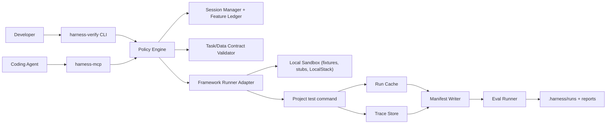
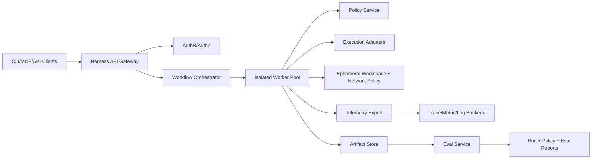

# Harness Architecture Design and OSS Replacement Assessment

Last updated: 2026-03-03

## 1) Objective

Design a production-grade harness architecture for long-running coding-agent workflows and decide where custom components should be replaced by proven open source libraries.

This document defines:
1. Current architecture and known constraints.
2. Target local and service architecture.
3. Boundary model for safe agent operation.
4. OSS replacement decisions and phased migration plan.

## 2) Architecture drivers

### Functional drivers
1. Run multi-framework test workflows from CLI and MCP.
2. Support long-running sessions with resumable artifacts and feature ledger discipline.
3. Enforce policy boundaries for data mode, filesystem scope, and operation class.
4. Generate machine-readable manifests and eval results for every run.

### Quality drivers
1. Deterministic run identity and persistence under concurrent execution.
2. Auditable policy decisions and contract checks.
3. Reliable observability for debugging and trend analysis.
4. CI-safe, reproducible validation loops.

## 3) Current architecture snapshot

### Implemented modules
1. Interface: `src/harness/verify.py`, `src/harness/mcp_server.py`.
2. Execution: `src/harness/runners/*`.
3. Persistence and traces: `src/harness/cache.py`, `src/harness/tracing.py`, `src/harness/trace_viewer.py`.
4. Session and workflow: `src/harness/session_manager.py`, `src/harness/manifest.py`.
5. Policy and contracts: `src/harness/policy.py`, `src/harness/contracts.py`.
6. Evals: `src/harness/evals/runner.py`.

### Current storage model
1. DuckDB for run history, test outcomes, and trace events.
2. File artifacts under `.harness/`:
   - `init.sh`
   - `feature_list.json`
   - `progress.md`
   - `task-contract.yaml`
   - `data-contract.yaml`
   - `runs/*.json`

## 4) Target architecture

### 4A) Local developer mode (default)

### 4B) Team service mode (target)

## 5) Boundary model (harness safety envelope)

### Trust boundaries
1. Boundary A: user/agent interface to harness runtime.
2. Boundary B: harness runtime to project workspace.
3. Boundary C: harness runtime to external network and cloud providers.
4. Boundary D: harness runtime to persistence and telemetry backends.

### Boundary invariants
1. Every execution request is policy-evaluated before command dispatch.
2. `data_mode=mock` remains default unless explicitly overridden.
3. File writes are constrained to approved project scope.
4. Denials are reported as structured events, not only plain text errors.
5. Every run emits a manifest linking policy decisions, test output, and traces.

## 6) Component design

### 6A) Interface layer
1. CLI for operator workflows and scripting.
2. MCP for coding-agent workflows.
3. Service API for multi-user queued execution (future).

### 6B) Session/workflow layer
1. Initializes `.harness` artifacts with deterministic templates.
2. Enforces feature-ledger updates with evidence requirements.
3. Supports resume-check and startup smoke validation.

### 6C) Policy and contracts layer
1. Policy checks command class, file path class, network access, and data mode.
2. Contract checks task contract completeness and optional data-contract integrity.
3. Policy + contract outcomes are persisted and included in manifests.

### 6D) Execution layer
1. Runner adapter maps framework to execution strategy.
2. Result normalization uses explicit `execution_status` semantics.
3. Non-zero execution status propagates to CLI exit and MCP response payload.

### 6E) Persistence and observability layer
1. Run history and traces are append-only for auditability.
2. Query APIs are parameterized and schema-version aware.
3. Trace events carry run IDs and event typing for analysis.

## 7) Data model (logical)

### Entities
1. `SessionRun`
   - `session_run_id`, actor, data_mode, start/end, status.
2. `ProjectRun`
   - `project_run_id`, `session_run_id`, project, framework, result summary.
3. `PolicyDecision`
   - action, allowed, reason, severity, metadata.
4. `ContractFinding`
   - contract type, allowed, reason, missing fields.
5. `FeatureEntry`
   - id, priority, steps, passes, evidence, last_verified_at.
6. `Manifest`
   - immutable artifact linking all entities for one project run.

### Required identity relations
1. One `SessionRun` can contain N `ProjectRun` rows.
2. Every trace event maps to exactly one `project_run_id` and one `session_run_id`.
3. Every manifest references one `project_run_id` and includes parent `session_run_id`.

## 8) Runtime sequences

### 8A) Standard feature implementation loop
1. `initialize_session` (or `resume-check`) reads bearings.
2. `get_next_feature` selects highest-priority incomplete work item.
3. `run_tests` executes with policy + contract preflight.
4. Cache + traces + manifest are persisted.
5. `eval run` grades safety/reliability/session discipline.
6. `update_feature_status --pass --evidence ...` finalizes feature state.

### 8B) Policy denial loop
1. Request enters policy preflight.
2. One or more decisions deny the action.
3. Execution is skipped.
4. Denial payload is returned to CLI/MCP.
5. Denial event is written to traces/manifests for audit.

### 8C) Resume loop
1. Parse `.harness/progress.md` and feature ledger.
2. Validate task contract and optional smoke check.
3. Surface pending feature and known blockers.
4. Resume with explicit data mode and constrained scope.

## 9) OSS replacement assessment

### Selection criteria
1. Production adoption and operational maturity.
2. Clear API and migration fit for current module seams.
3. Strong documentation and active maintenance.
4. Ability to run in local developer mode and service mode.

| Area | Current component | Candidate OSS | Maturity signal | Integration fit | Decision |
|---|---|---|---|---|---|
| Policy engine | `policy.py` | Open Policy Agent (OPA/Rego) | Widely used policy-as-code platform with documented sidecar/API integration | High: can sit behind existing policy interface | Adopt in service mode; keep local fallback |
| Tracing/telemetry | `tracing.py` + DuckDB traces | OpenTelemetry SDK + OTLP | Cross-vendor observability standard with mature Python support | High: wrap existing trace emit calls | Adopt instrumentation; keep DuckDB query tools for local analytics |
| Workflow orchestration | In-process command flow | Temporal Python SDK | Durable workflows with retries, heartbeats, and resume semantics | Medium-high: maps to session/run lifecycle | Adopt for service mode queued execution |
| Persistence abstraction | Direct SQL in modules | SQLAlchemy + Alembic | Mature ORM/query/migration tooling | High: can preserve current schema while adding migration control | Adopt for schema control + query safety |
| Contract portability | Pydantic-only internals | `jsonschema` | Stable spec implementation, language-agnostic schemas | High: complementary to current validation | Adopt for external schema compatibility |
| Eval ecosystem | Custom eval runner | Promptfoo and/or OpenAI Evals | Established eval tooling and CI integration patterns | Medium: adapter needed for manifest ingestion | Hybrid: keep deterministic local checks, add provider adapters |
| Integration test infra | Manual local dependencies | Testcontainers (Python) | Established containerized integration testing ecosystem | Medium-high: replace ad-hoc service orchestration | Adopt for integration-test reliability |
| Docs linting | `scripts/lint_docs.py` only | markdownlint-cli2 | Mature lint rules + GitHub action support | High: additive with current semantic lint | Adopt with current custom semantic lint retained |

### OSS references
1. Open Policy Agent docs: [https://www.openpolicyagent.org/docs/](https://www.openpolicyagent.org/docs/)
2. OpenTelemetry docs: [https://opentelemetry.io/docs/](https://opentelemetry.io/docs/)
3. Temporal docs: [https://docs.temporal.io/](https://docs.temporal.io/)
4. SQLAlchemy docs: [https://docs.sqlalchemy.org/](https://docs.sqlalchemy.org/)
5. Alembic docs: [https://alembic.sqlalchemy.org/](https://alembic.sqlalchemy.org/)
6. jsonschema docs: [https://python-jsonschema.readthedocs.io/en/stable/](https://python-jsonschema.readthedocs.io/en/stable/)
7. Promptfoo docs: [https://www.promptfoo.dev/docs/](https://www.promptfoo.dev/docs/)
8. OpenAI Evals repo: [https://github.com/openai/evals](https://github.com/openai/evals)
9. Testcontainers org: [https://github.com/testcontainers](https://github.com/testcontainers)
10. markdownlint-cli2: [https://github.com/DavidAnson/markdownlint-cli2](https://github.com/DavidAnson/markdownlint-cli2)

## 10) Keep vs replace decisions

### Keep custom (harness-specific core logic)
1. Runner normalization (`runners/*`) for cross-framework status semantics.
2. Feature-ledger semantics and evidence rules.
3. Manifest schema and grader contracts.

### Replace with OSS (platform concerns)
1. Policy backend in distributed mode (OPA).
2. Tracing export and correlation pipeline (OpenTelemetry).
3. Workflow durability in service mode (Temporal).
4. DB abstraction and migration discipline (SQLAlchemy/Alembic).
5. Interop schema validation (jsonschema).
6. External eval integration (Promptfoo/OpenAI Evals adapters).
7. Integration test dependency lifecycle (Testcontainers).

## 11) Phased migration plan

### Phase A: local hardening (low risk)
1. Introduce repository layer wrapping persistence calls.
2. Add SQLAlchemy models over current schema and verify parity.
3. Add OpenTelemetry spans around CLI and MCP execution paths.
4. Keep existing functionality as default path behind feature flags.

### Phase B: controlled substitution
1. Add OPA adapter implementing existing `PolicyEngine` interface.
2. Add JSON Schema export/validation for task/data contracts.
3. Add Promptfoo/OpenAI eval adapters behind an eval provider interface.
4. Add markdownlint-cli2 and Testcontainers-based integration test lane.

### Phase C: service architecture
1. Add API gateway and auth boundary.
2. Move run orchestration to Temporal workflows and workers.
3. Move telemetry to OTLP backend and artifacts to managed storage.
4. Keep local mode path intact for developer iteration speed.

## 12) Delivery plan (isolated execution tasks)

1. `A01`: add `repository.py` abstraction and migrate cache/trace call sites.
2. `A02`: add SQLAlchemy + Alembic baseline without changing behavior.
3. `A03`: add OpenTelemetry wrapper and emit spans in verify/MCP/session flows.
4. `A04`: add policy backend interface and optional OPA adapter.
5. `A05`: add eval-provider interface and Promptfoo/OpenAI adapters.
6. `A06`: add Testcontainers integration-test path and CI lane.
7. `A07`: add service-mode architecture companion and API contract draft.

## 13) Developer workflow examples (within boundary)

### Example 1: implement one feature safely (local mode)
1. `harness-verify init-project --path .`
2. `harness-verify resume-check --path . --smoke`
3. `harness-verify feature next --path .`
4. Agent edits files in approved scope.
5. `harness-verify verify --project . --data-mode mock --json`
6. `harness-verify eval run --path .`
7. `harness-verify feature update --path . --feature-id FEAT-123 --pass --evidence "verify:session=<id>"`

Outcome:
1. Feature can only be marked pass after verification evidence.
2. Manifest and traces are linked for later audit.

### Example 2: policy denial and recovery
1. Agent requests action outside file/data boundaries.
2. Policy engine returns denial with reason and action class.
3. Developer narrows scope (or updates approved contract/policy path).
4. Agent retries inside allowed boundary.

Outcome:
1. Unsafe path is blocked deterministically.
2. Denial appears in trace and manifest for review.

### Example 3: resume after context loss
1. Developer starts new session and runs `initialize_session` (MCP) or `resume-check` (CLI).
2. Harness returns pending feature, recent progress, and smoke-check status.
3. Agent continues from feature ledger state instead of re-deriving context.

Outcome:
1. Reduced context drift and duplicated work.
2. Session progress remains auditable and reproducible.

## 14) Risks and tradeoffs

1. OPA/Rego and Temporal increase platform complexity and operational ownership.
2. OpenTelemetry improves observability but adds backend management burden.
3. SQLAlchemy/Alembic migration requires careful backward compatibility with existing DuckDB data.
4. External eval tooling improves signal coverage but can introduce nondeterminism if not pinned and sandboxed.

## 15) Exit criteria for architecture completion

1. Every runtime concern has one clear owning component and interface boundary.
2. Keep-vs-replace decisions are explicit with phased migration sequence.
3. Developer workflows are documented for both success and denial/resume paths.
4. CI has checks that enforce architecture-critical invariants.
