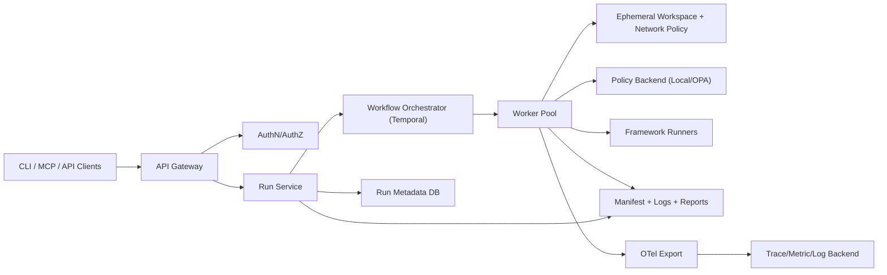
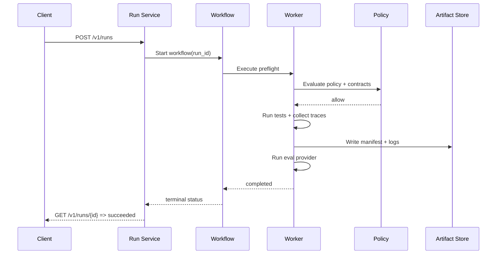
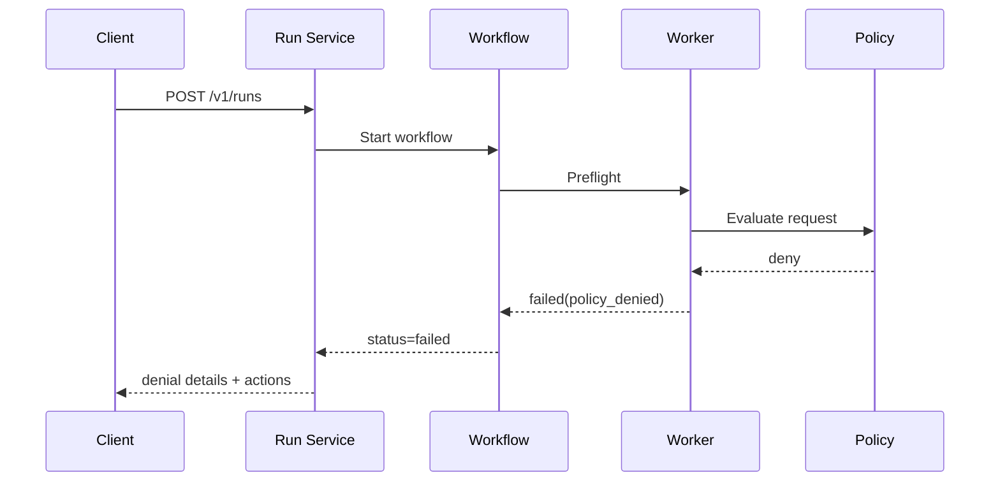

# Harness Service Architecture (Multi-User Mode)

Last updated: 2026-03-03

## 1) Goal

Define implementation-ready service architecture for multi-user harness execution with clear boundaries across:
1. Control plane API.
2. Workflow/orchestration layer.
3. Isolated worker runtime.
4. Policy, artifact, and observability services.

## 2) Scope

This document specifies:
1. Service components and ownership boundaries.
2. API contract shape for run lifecycle.
3. Worker orchestration and state model.
4. Auth/policy/telemetry integration points.
5. Migration dependencies from local mode.

## 3) Component architecture



## 4) Control-plane and worker boundaries

### Control plane owns
1. Authentication and authorization.
2. Run creation, status queries, cancellations.
3. Workflow scheduling and metadata indexing.
4. Access control to manifests/logs/eval reports.

### Worker plane owns
1. Workspace checkout/worktree isolation.
2. Policy checks and command execution.
3. Test runner invocation and result capture.
4. Manifest write and eval trigger.

### Boundary invariants
1. Workers are stateless between runs.
2. Control plane never executes project commands directly.
3. All run state transitions are evented and persisted.
4. Artifacts are immutable once run reaches terminal state.

## 5) API contract (draft)

## POST `/v1/runs`

Create a new run request.

Request:
```json
{
  "project_path": "/repo/path",
  "data_mode": "mock",
  "last_failed": false,
  "provider": "local",
  "options": {
    "trace": true,
    "run_smoke_check": false
  }
}
```

Response:
```json
{
  "run_id": "session-uuid",
  "status": "queued",
  "created_at": "2026-03-03T18:30:00Z"
}
```

## GET `/v1/runs/{run_id}`

Return run status and summary.

Response:
```json
{
  "run_id": "session-uuid",
  "status": "running",
  "policy": {
    "allowed": true,
    "backend": "local"
  },
  "project_runs": [
    {
      "project_run_id": "project-uuid",
      "project": "repo",
      "framework": "pytest",
      "execution_status": "ok"
    }
  ]
}
```

## GET `/v1/runs/{run_id}/events`

Stream workflow events (SSE/websocket or paginated pull).

Event shape:
```json
{
  "timestamp": "2026-03-03T18:31:00Z",
  "event_type": "policy.decision",
  "run_id": "session-uuid",
  "project_run_id": "project-uuid",
  "payload": {"allowed": true, "action": "framework.allowlist"}
}
```

## POST `/v1/runs/{run_id}/cancel`

Cancel queued/running workflow.

## GET `/v1/runs/{run_id}/artifacts`

List manifests, logs, and eval reports.

## 6) Workflow state model

States:
1. `queued`
2. `preflight`
3. `running`
4. `evaluating`
5. `succeeded`
6. `failed`
7. `cancelled`

State transition rules:
1. `queued -> preflight -> running` for policy/contract pass.
2. Any denial in preflight moves to `failed` with reason `policy_denied` or `contract_invalid`.
3. `running -> evaluating` after project runs and manifest writes complete.
4. `evaluating -> succeeded|failed` based on eval outcome.

## 7) Sequence flows

### Standard run



### Policy denial



## 8) Auth and policy requirements

1. AuthN: token-based user/service identity.
2. AuthZ: project-scope RBAC for run creation and artifact read.
3. Policy backend selection:
   - `local` for bootstrap.
   - `opa` for centralized policy-as-code.
4. Mandatory audit fields on every decision:
   - actor
   - action
   - allowed
   - reason
   - run_id/project_run_id

## 9) Storage and retention

1. Metadata DB stores run headers, state transitions, and indices.
2. Artifact store retains manifests, summaries, logs, eval outputs.
3. Telemetry backend retains traces/metrics for SLO dashboards.
4. Retention policy defaults:
   - metadata: 90 days
   - detailed logs/traces: 30 days
   - manifests/eval summaries: 180 days

## 10) Operational SLOs

1. Run creation p95 latency: < 500ms.
2. Queue-to-start p95 latency: < 60s.
3. Workflow reliability (terminal state emitted): >= 99.9%.
4. Artifact availability for completed runs: >= 99.95%.

## 11) Migration dependencies from local mode

Required before production service rollout:
1. `A01` repository abstraction completed.
2. `A02` SQLAlchemy/Alembic baseline completed.
3. `A03` OpenTelemetry wrapper completed.
4. `A04` policy backend abstraction completed.
5. `A05` eval provider abstraction completed.
6. `A06` integration lane completed.

Service rollout phases:
1. Phase S1: single-tenant service deployment, local policy backend.
2. Phase S2: OPA policy backend + external artifact store.
3. Phase S3: multi-tenant RBAC and quota controls.

## 12) Review checklist

1. Control-plane/worker boundary is explicit and enforceable.
2. Run IDs and project-run IDs are propagated in every API/event path.
3. Policy and contract denials are deterministic and auditable.
4. Eval provider used for each run is visible in run summaries.
5. Cancellation and failure semantics are explicit.
