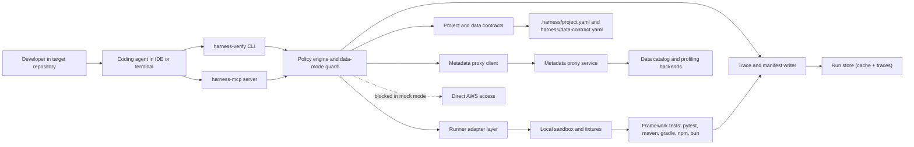
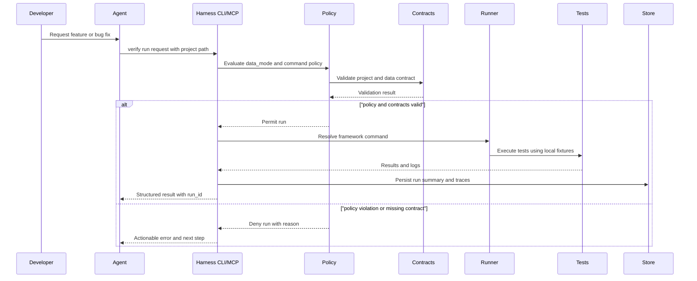
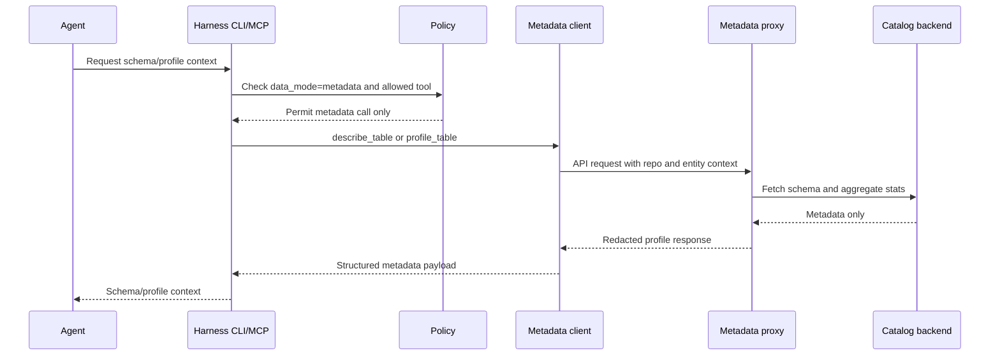
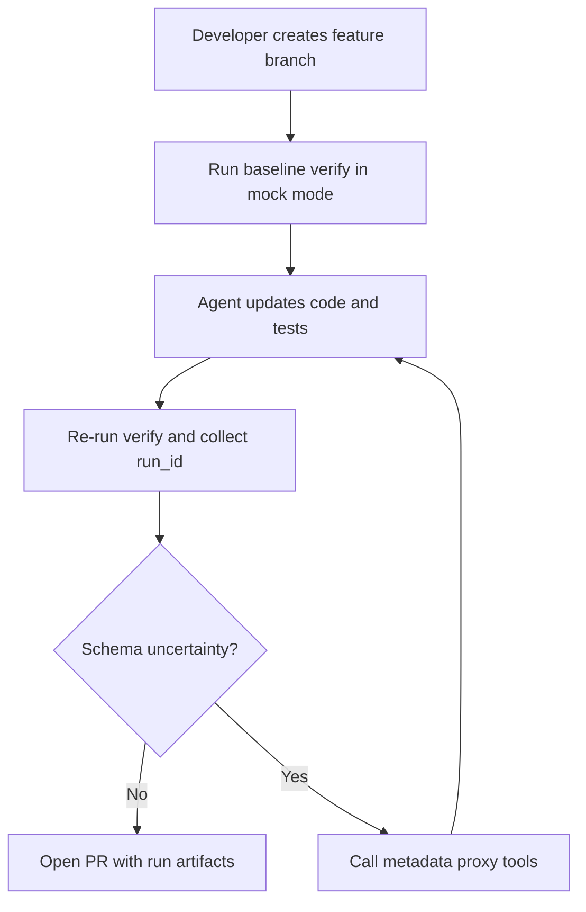
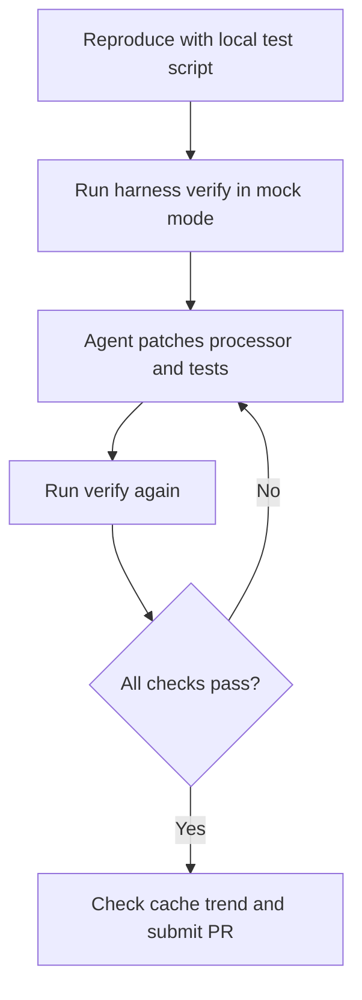
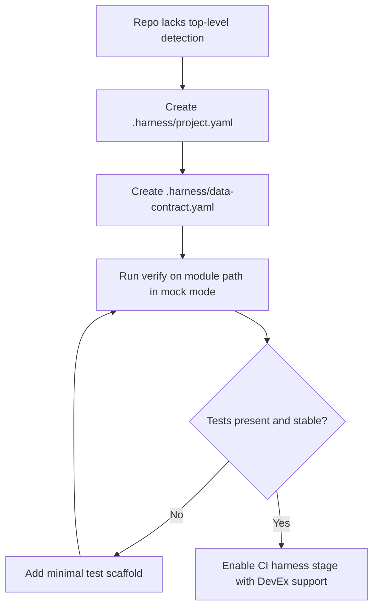

# Harness Team Implementation Plan

Last updated: 2026-03-02

## 1) Goal and Operating Model

### Goal
Provide one team-wide harness that lets developers run coding agents in a controlled environment, with strong safeguards against drift, hallucination, unsafe actions, and regression.

### Team-level outcomes
1. Developers can run agent-assisted feature and bug-fix loops on any target repo through one interface.
2. Agent runs are reproducible, auditable, and gated by policy and tests.
3. Safety and quality checks are mechanical (tests/evals/policy), not only prompt-driven.

### Non-goals for initial rollout
1. Full autonomous deploy-to-production.
2. Replacing existing CI systems in one step.
3. Solving every framework-specific edge case before pilot.

## 2) Current State Assessment (What is already covered)

### Implemented today
1. Multi-framework project detection and test command generation:
   - `pytest`, `pyspark`, `npm`, `bun`, `maven`, `gradle`, `sbt`, `cargo`, `go`
   - Files: `src/harness/config.py`
2. Unified verification CLI and summary/JSON output:
   - File: `src/harness/verify.py`
3. Result persistence and trend views in DuckDB:
   - File: `src/harness/cache.py`
4. Trace storage and trace query/view commands:
   - Files: `src/harness/tracing.py`, `src/harness/trace_viewer.py`
5. MCP server with test/cache/trace tools:
   - File: `src/harness/mcp_server.py`
6. Scaffolding for pytest/bun/npm + LocalStack/DuckDB config:
   - File: `src/harness/scaffold.py`

### Gaps blocking a safe team rollout
1. Safe defaults are not strict enough:
   - S3 helper falls back to real AWS client if sandbox config is missing.
2. Reliability defects in run identity and store lifecycle:
   - MCP run IDs are not robust.
   - Shared cache/trace handles are closed and then reused.
3. `--last-failed` and `--trace` paths are partial/no-op in the main verify loop.
4. `npm` projects are routed through Bun runner.
5. SQL query construction has interpolation and malformed query edge cases.
6. Repo detection only inspects top-level root:
   - misses nested modules such as `<module_path>/pom.xml` in some repos.
7. Missing eval harness and policy layer for anti-hallucination controls.
8. No explicit multi-user service mode with auth/RBAC/approval workflow.

## 3) Success Criteria and KPIs

### Safety KPIs
1. `0` unapproved external-network writes during agent runs.
2. `0` accidental real AWS API calls when run mode is `safe`.
3. `100%` of risky operations produce explicit approval/audit events.

### Quality KPIs
1. Agent task success rate (graded): `>= 80%` on pilot suite.
2. Regression rate after merge: `< 5%` on harness-managed PRs.
3. Median recovery time from failed agent run: `< 15 min`.

### Adoption KPIs
1. At least `3` target repos onboarded in pilot.
2. At least `15` weekly active developers using harness CLI or MCP.
3. At least `70%` of agent-generated PRs include harness artifacts (run manifest + eval report).

## 3A) No-AWS Data Strategy (Default)

### Principle
If direct AWS access is unavailable or disallowed, agent runs must still be productive using deterministic mocks, developer-provided contracts, and metadata-only introspection.

### Runtime data modes
1. `mock` (default)
   - Agent can use local fixtures, synthetic records, and deterministic stubs only.
   - No direct AWS reads/writes.
2. `metadata`
   - Agent can query schema/profile information from a metadata proxy.
   - No row-level payload access and no raw customer data.
3. `human-contract`
   - Agent pauses when information is insufficient and requires explicit developer-provided assumptions/fixtures before implementation continues.

### Mode fallback order
1. Try `mock` first.
2. If schema/shape uncertainty blocks progress, use `metadata`.
3. If ambiguity remains, require `human-contract` input.

### Required repository contract files
1. `.harness/project.yaml`
   - runtime/test command and module detection overrides.
2. `.harness/data-contract.yaml`
   - approved source datasets, assumptions, invariants, and fixture references.

### Example `data-contract.yaml` schema
```yaml
version: 1
data_mode_default: mock
entities:
  - name: cln_genomic_summary
    purpose: "Transactional filter and EGFR derivation"
    required_columns:
      - finalreportdate
      - gene
      - alteration_detected
      - alt_value
    constraints:
      - "finalreportdate must parse as yyyy-mm-dd"
      - "alteration_detected in [true,false,null]"
    fixture_path: tests/fixtures/cln_genomic_summary_minimal.json
  - name: accession
    purpose: "Eligibility filtering"
    required_columns:
      - projectid
      - reportstatus
      - clientstate
      - clientcountry
      - trfversion
approval_required_for:
  - "new source entity"
  - "constraint relaxation"
```

### Metadata proxy service contract (no row access)
1. `describe_table`
   - Inputs: `dataset`, `table`
   - Output: columns, types, partition keys, ownership tags.
2. `profile_table`
   - Inputs: `dataset`, `table`, `columns[]`
   - Output: row count bucket, null ratio, distinct count bucket, min/max for numeric/date columns.
3. `get_column_stats`
   - Inputs: `dataset`, `table`, `column`
   - Output: completeness, cardinality bucket, top-k tokenized values if approved and k-anonymous.
4. `sample_values`
   - Disabled in default profile.

### Enforcement rules
1. In `mock` mode, block all direct AWS SDK/CLI calls.
2. In `metadata` mode, allow only proxy MCP tools, not raw database connections.
3. Emit policy event for every blocked attempt and approval request.
4. Fail eval if implementation relies on undeclared assumptions not present in `data-contract.yaml`.

### Profile-based concrete mapping
1. Python transformation repo profile
   - Build fixtures from existing unit-test helper rows and deterministic edge-case examples.
   - Use metadata mode only for schema drift checks and date column profiling.
2. File-processing ingestion repo profile
   - Use local file fixtures and synthetic metadata for processor/validator logic.
   - Metadata mode can expose manifest schema, never raw file payload.
3. JVM utility repo profile
   - Use local fixture paths under test resource directories.
   - Mock cloud key/secret dependencies via deterministic local provider interface.

## 4) Detailed Implementation Roadmap

## Phase 0: Core Hardening (Weeks 1-2)

### Objective
Make current code correct and reliable enough for controlled pilot use.

### Workstream A: Run identity and persistence reliability
1. Replace hash-based run IDs with UUIDv7/ULID.
2. Ensure one run ID links verify output, cache rows, and trace rows.
3. Refactor cache/trace lifecycle so connection ownership is explicit.
4. Add run metadata table:
   - repo path, git commit, branch, actor, start/end timestamps, status.

### Workstream B: Runner correctness
1. Split npm into dedicated npm runner (`npm test`) and keep bun separate.
2. Implement real `--last-failed` for pytest:
   - store node IDs from previous failed run.
   - pass them to pytest command on rerun.
3. Ensure verify summary reflects subprocess exit codes accurately.

### Workstream C: Trace correctness
1. Wire `--trace` in verify path so test execution actually emits trace events.
2. Persist duration fields for trace events.
3. Add defensive JSON serialization for payloads and errors.

### Workstream D: Safety defaults and SQL safety
1. Remove default fallback to real AWS client in safe mode.
2. Add explicit modes:
   - `safe-local` (default): no real AWS/network.
   - `mock` data mode as default.
   - `allow-aws-readonly`: explicit opt-in.
   - `allow-aws-write`: explicit opt-in with approval.
3. Add run-level `data_mode` flag and policy checks:
   - `mock`, `metadata`, `human-contract`.
4. Parameterize SQL queries and remove string interpolation from filtering paths.
5. Fix malformed `WHERE/AND` clause construction in cache error queries.
6. Add explicit error when agent attempts direct AWS access in `mock` mode.

### Workstream E: Portability and detection
1. Remove hardcoded Windows default scan paths.
2. Add recursive module detection:
   - discover framework files up to configurable depth (default `3`).
3. Add per-repo override config:
   - `.harness/project.yaml` for custom test command and test root.

### Deliverables
1. Stable CLI/MCP behavior for repeated runs.
2. Safe-by-default runtime with explicit mode controls.
3. Unit and integration tests covering above fixes.

### Exit criteria
1. 100 consecutive smoke runs in CI without cache/trace handle failures.
2. `safe-local` mode never calls real AWS in integration tests.
3. `--last-failed` reduces pytest rerun scope in test fixture repo.

## Phase 1: Policy and Isolation Layer (Weeks 3-5)

### Objective
Constrain agent execution environment and risky actions by policy.

### Workstream A: Sandbox isolation
1. Add per-run workspace cloning/worktree isolation.
2. Add per-run ephemeral filesystem area for temporary outputs.
3. Enforce network policy by mode:
   - disabled by default.
   - allowlist for approved domains/services.
4. Standardize LocalStack lifecycle for all sandboxed AWS-like tests.

### Workstream B: Policy engine
1. Implement policy rules for command categories:
   - read-only, write-local, write-remote, destructive.
2. Implement path allowlist and denylist rules.
3. Add operation-level approval checkpoints for high-risk actions.
4. Emit policy decision events into trace store.

### Workstream C: Secrets and identity hygiene
1. Prevent raw key material in logs and traces.
2. Redact sensitive env vars in subprocess output capture.
3. Add per-run credentials strategy:
   - local fake creds for sandbox.
   - explicit broker path for real AWS access.

### Workstream D: Metadata proxy for schema/profile access
1. Implement metadata proxy service with read-only aggregated endpoints.
2. Add MCP tools:
   - `describe_table`, `profile_table`, `get_column_stats`.
3. Enforce no row-level data responses and k-anonymity thresholds.
4. Add proxy-side audit logs and request quotas.

### Deliverables
1. `policy.yaml` and runtime policy evaluator.
2. Approval event model and audit trail.
3. Security regression tests.
4. Metadata proxy MVP with MCP integration.

### Exit criteria
1. Policy violation attempts are blocked and logged.
2. Audit trail is complete for command + file + network actions.
3. Approved exception paths are deterministic and reproducible.
4. Metadata mode supports at least three pilot entities without row access.

## Phase 2: Evals and Hallucination Controls (Weeks 6-8)

### Objective
Move from best-effort to measurable agent reliability.

### Workstream A: Task contracts and run manifests
1. Introduce first-class task contract schema:
   - `Goal`, `Constraints`, `FilesInScope`, `AcceptanceCriteria`, `ValidationSteps`.
2. Require contract for every non-trivial agent run.
3. Generate run manifest artifact:
   - contract hash, commands run, changed files, test/eval results.

### Workstream B: Graders and eval suites
1. Build trace graders for deterministic checks:
   - disallowed commands not called.
   - required validation steps executed.
   - final status aligns with tests.
2. Build output graders for quality checks:
   - expected files changed.
   - expected test delta.
   - doc or migration requirements satisfied.
3. Build baseline eval corpora from real target-repo workflows.
4. Add data-mode graders:
   - fail if direct AWS/data access appears in `mock`/`metadata` runs.
   - fail if undeclared table/column assumptions appear outside `data-contract.yaml`.

### Workstream C: CI integration
1. Add harness eval stage in CI:
   - fail on eval regressions above threshold.
2. Publish eval trend dashboards from DuckDB exports.
3. Add weekly review process for failed eval cases.

### Deliverables
1. Eval runner and grading library.
2. Pilot eval suites for `pytest` + `maven`.
3. CI gate and report artifacts.
4. Data-mode compliance report per run.

### Exit criteria
1. At least 20 representative eval tasks per pilot framework.
2. Stable eval pass rate trend for two consecutive weeks.
3. Merge gate active for pilot repos.

## Phase 3: Multi-repo Onboarding (Weeks 9-10)

### Objective
Onboard heterogeneous repositories with minimal friction.

### Repository onboarding profiles
1. Profile A: Top-level pytest repos
   - `<repo_pytest_1>`
   - `<repo_pytest_2>`
2. Profile B: Top-level Maven repos
   - `<repo_maven_1>`
   - `<repo_maven_2>`
3. Profile C: Nested-module repos (currently under-detected)
   - `<repo_nested_1>` (`<module_path_1>/pom.xml`)
   - `<repo_nested_2>` (`<module_path_2>/pom.xml`)

### Workstream A: Onboarding automation
1. `harness-verify onboard --project <path>` command:
   - detect profile.
   - generate `.harness/project.yaml`.
   - verify baseline command.
2. Add optional repo bootstrap templates:
   - minimal tests folder if absent.
   - CI workflow snippet for harness verify/eval.

### Workstream B: Framework adapters
1. Add nested module adapter:
   - support `module_path` and custom command.
2. Add Python script-style test adapter for repos with script tests.
3. Normalize junit/pytest result extraction into common schema.

### Deliverables
1. Onboarding command and generated config standard.
2. 6 repos onboarded (2 per profile).
3. Onboarding runbook.

### Exit criteria
1. New developer can onboard a repo in < 30 minutes.
2. Baseline verify + cache trend works for all onboarded repos.

## Phase 4: Developer UX and MCP Productization (Weeks 11-12)

### Objective
Make daily usage simple for both humans and coding agents.

### Workstream A: CLI UX
1. Add `harness-verify doctor` for dependency and environment checks.
2. Improve command output with stable machine-readable schema versions.
3. Add `harness-verify plan` to preview run policy and test scope before execution.

### Workstream B: MCP hardening
1. Version MCP tool schemas.
2. Add structured error codes and retry hints.
3. Ensure all MCP calls return run IDs and manifest pointers.

### Workstream C: Documentation and enablement
1. Publish developer quickstart, safety guide, and troubleshooting guide.
2. Provide short task contract examples for common workflows.
3. Add internal enablement sessions with live repo demos.

### Deliverables
1. Stable v1 CLI and MCP contract docs.
2. Developer onboarding kit.
3. Usage analytics for adoption KPIs.

### Exit criteria
1. Pilot developers can complete feature/bug flows without platform team help.
2. MCP integration works reliably in long-running agent sessions.

## Phase 5: Organization Rollout and Governance (Weeks 13-16)

### Objective
Scale from pilot to team-wide operating model.

### Workstream A: Service mode (optional but recommended)
1. Introduce `harnessd` service:
   - queue jobs.
   - execute in isolated workers.
   - centralize policies and audit logs.
2. Add auth/RBAC for teams, repos, and policy scopes.

### Workstream B: Governance
1. Define change management process for policy/eval changes.
2. Add SLOs for harness service and incident handling.
3. Add regular red-team scenarios for policy bypass attempts.

### Workstream C: Rollout plan
1. Expand from pilot repos to remaining target repos in batches.
2. Track repo-level readiness score:
   - tests present.
   - harness config.
   - CI integration.
   - policy compliance.

### Deliverables
1. Production-ready team platform.
2. Governance handbook.
3. Repo readiness dashboard.

### Exit criteria
1. 80% of target repos onboarded.
2. Harness is default path for agent-assisted changes in onboarded repos.

## 5) Engineering Work Breakdown (Concrete backlog)

## P0 backlog (must complete before pilot)
1. Fix safe default AWS behavior.
2. Fix run ID uniqueness and run metadata.
3. Fix closed singleton connection reuse.
4. Implement `--last-failed`.
5. Implement actual trace instrumentation for verify.
6. Separate npm and bun runner paths.
7. Parameterize SQL and query builder fixes.
8. Add regression tests for each bug.
9. Add `data_mode` runtime flag with default `mock`.
10. Add hard policy that blocks direct AWS in `mock` mode.

## P1 backlog (pilot hardening)
1. Add recursive detection + `.harness/project.yaml`.
2. Add policy engine and safe mode controls.
3. Add metadata proxy MCP tools.
4. Add `.harness/data-contract.yaml` template and validator.
5. Add `doctor` and `onboard` commands.
6. Add run manifest and artifact model.

## P2 backlog (scale)
1. Add eval runner + graders + CI gates.
2. Add dashboard exports and trend reporting.
3. Add service mode with RBAC and approvals.
4. Add centralized metadata proxy governance and usage analytics.

## 6) End-to-end Developer Playbooks (Parameterized)

### Placeholder conventions
1. `<repo_root>`: local filesystem path to a repository root.
2. `<project_name>`: logical project identifier used by harness cache/trend views.
3. `<module_path>`: nested build/test module path under a repo root.
4. `<source_file>`, `<test_file>`, `<processor_file>`: files changed for a task.
5. `<trend_limit>`: number of historical runs to display.
6. `<repo_*_pilot>`: pilot candidate repos selected by your team.

## Playbook A: New feature in `<repo_feature>` (pytest profile)

### Scenario
Add or change business logic in `<source_file>` and matching unit tests in `<test_file>`.

### Steps
1. Create branch in repo:
```bash
cd <repo_root>
git switch -c codex/<feature-branch-name>
```
2. Baseline detection and run:
```bash
harness-verify detect <repo_root>
harness-verify verify --project <repo_root> --json --data-mode mock
```
3. Confirm or create `.harness/data-contract.yaml` for the affected entities.
4. Implement feature changes in `<source_file>` and `<test_file>`.
5. Re-run verify:
```bash
harness-verify verify --project <repo_root> --json --data-mode mock
```
6. If blocked by schema uncertainty, run metadata-only checks:
```bash
harness-mcp
# then call: describe_table / profile_table for required entities
```
7. Check trend and regression visibility:
```bash
harness-verify cache trend <project_name> --limit <trend_limit>
```
8. Open PR with harness artifacts:
   - run ID
   - JSON summary
   - data mode used and contract hash
   - test delta summary

### Expected value
1. Agent stays within one repo/test loop.
2. Developer sees structured pass/fail changes quickly.
3. History is queryable for regressions over time.

## Playbook B: Bug fix in `<repo_bugfix>` (pytest profile with local repro script)

### Scenario
Fix an edge case in `<processor_file>` and validate with a local repro script plus unit tests.

### Steps
1. Create branch:
```bash
cd <repo_root>
git switch -c codex/<bugfix-branch-name>
```
2. Baseline verify:
```bash
harness-verify verify --project <repo_root> --json --data-mode mock
```
3. Reproduce via local script and unit tests:
```bash
python3 <repro_script_path>
harness-verify verify --project <repo_root> --json --data-mode mock
```
4. Implement fix in `<processor_file>` and update `<test_file>` or `<repro_script_path>`.
5. Validate again and compare trend:
```bash
harness-verify cache trend <project_name> --limit <trend_limit>
```

### Expected value
1. Bug reproduction and fix are kept in one repeatable harness workflow.
2. Cache history captures when the regression was fixed.

## Playbook C: Start harness-enabled workflow for `<repo_onboarding>` (nested module profile)

### Scenario
Repo has tests/build files under `<module_path>` and no top-level test profile, so onboarding is needed before agent-driven feature work.

### Steps (current state)
1. Add local harness config in repo root (interim):
   - `.harness/project.yaml` with module path and command:
```yaml
project_name: <project_name>
framework: <framework>
module_path: <module_path>
command:
  - <test_command_bin>
  - <test_command_arg_1>
```
2. Add `.harness/data-contract.yaml` to declare fixtures and assumptions for this module.
3. Run verify against module path directly in mock mode:
```bash
harness-verify verify --project <repo_root>/<module_path> --json --data-mode mock
```
4. Add minimal test scaffold under `<module_path>/<test_root>` if missing.
5. Execute feature work and rerun verify.

### Steps (target state after Phase 3)
1. Run one command:
```bash
harness-verify onboard --project <repo_root>
```
2. Harness auto-generates config, detects nested module, and validates baseline.
3. Developer uses normal loop:
```bash
harness-verify verify --project <repo_root> --json --data-mode mock
```

### Expected value
1. New or legacy repos can be onboarded without custom per-developer scripts.
2. Agent workflows become consistent across repo structures.

## 7) MCP-first Usage Pattern for Developers

### MCP server registration
1. Add harness server:
```json
{
  "mcpServers": {
    "harness": {
      "command": "harness-mcp"
    }
  }
}
```

### Example MCP flow for feature delivery
1. Agent calls `detect_framework`.
2. Agent loads `.harness/data-contract.yaml`.
3. Agent calls `run_tests` for baseline in `mock` mode.
4. If schema context is missing, agent calls `describe_table`/`profile_table` via metadata proxy.
5. Agent edits code.
6. Agent calls `run_tests` again.
7. Agent calls `get_cache_trend` for regression context.
8. Agent includes run IDs, data mode, and contract hash in PR notes.

## 8) Risks and Mitigations

1. Risk: policy too strict blocks productivity.
   - Mitigation: policy tiers and explicit temporary exceptions with audit logs.
2. Risk: heterogeneous repo layouts break auto-detection.
   - Mitigation: recursive detection + `.harness/project.yaml` overrides.
3. Risk: teams bypass harness.
   - Mitigation: CI gates + better UX than ad-hoc scripts.
4. Risk: eval maintenance burden.
   - Mitigation: start with top failure classes and expand incrementally.

## 9) Immediate Next Actions (This Week)

1. Create tickets for Phase 0 P0 backlog items.
2. Implement and merge run ID + store lifecycle fixes first.
3. Remove unsafe AWS fallback and ship safe mode defaults.
4. Define and publish `.harness/data-contract.yaml` v1 schema.
5. Build metadata proxy MVP (`describe_table`, `profile_table`, `get_column_stats`).
6. Pilot with three repos:
   - `<repo_pytest_pilot>`
   - `<repo_ingestion_pilot>`
   - `<repo_jvm_pilot>`
7. Publish a short onboarding memo with Playbooks A/B/C + no-AWS data mode guidance.

## 10) Ownership Split: What We Control Here vs External Dependencies

### 10A) Work fully controllable in this repository

| Area | Concrete work in this repo | Primary outputs |
|---|---|---|
| Core runtime reliability | run ID model, cache/trace lifecycle fixes, stable CLI/MCP return schema | deterministic repeated runs and valid run linkage |
| Test execution layer | npm runner split, `--last-failed`, recursive detection, nested module config support | accurate framework execution across heterogeneous repo layouts |
| Safety runtime policy | `data_mode` (`mock`, `metadata`, `human-contract`), direct AWS blocking in mock mode, policy events | safe-by-default no-AWS execution |
| Contract system | `.harness/project.yaml` and `.harness/data-contract.yaml` schema + validation | explicit assumptions and reproducible run context |
| Eval/grade framework | data-mode compliance graders, trace graders, manifest generation | measurable anti-hallucination gates |
| Developer UX | `doctor`, `onboard`, improved diagnostics and structured errors | easier adoption for repo teams |
| Documentation and templates | onboarding docs, playbooks, config templates | standardized usage and governance |

### 10B) Work requiring support from other teams

| Dependency area | Needed from other teams | Why external support is required |
|---|---|---|
| CI/CD updates in target repos | add harness verify/eval stages, artifact upload, merge gate policies | each repo pipeline is owned outside this harness repo |
| Infrastructure platform | runtime workers, queue, central trace/cache storage, service deployment, observability | production service operation and scaling are infra responsibilities |
| Metadata proxy service | build/operate schema/profile APIs with privacy controls | data platform ownership and governance boundaries |
| IAM and security policy | permission model, approval flow policy, exception process | org-level risk and compliance controls |
| Repo onboarding execution | per-repo maintainers creating fixtures/contracts and stabilizing tests | domain knowledge lives with product teams |

### 10C) External support requests to open immediately

| Request | Target team | Deliverable | Target date |
|---|---|---|---|
| "Harness CI integration pattern" | DevEx/CI | reusable pipeline job template and required status checks | Week 2 |
| "Metadata proxy MVP contract" | Data Platform | API spec for describe/profile endpoints and access policy | Week 3 |
| "Safe runtime environment" | Infra Platform | isolated worker runtime with network policy controls | Week 4 |
| "Approval and audit policy" | Security/GRC | policy baseline and approval classes for risky operations | Week 4 |

## 11) Detailed Architecture Design

### 11A) Logical architecture (no-AWS default)



### 11B) Control plane vs execution plane

1. Control plane:
   - policy evaluation
   - mode selection (`mock` vs `metadata` vs `human-contract`)
   - contract validation
   - approval checks
   - eval grading and merge gate status
2. Execution plane:
   - framework-specific test commands
   - local fixture/materialized mock handling
   - trace event capture and artifact generation

### 11C) Run lifecycle sequence (default `mock` mode)



### 11D) Metadata mode sequence (no row-level data)



### 11E) Key internal components and interfaces

| Component | Responsibility | Interface shape |
|---|---|---|
| Policy engine | allow/deny operations and mode enforcement | `evaluate(action, context) -> decision` |
| Contract validator | validate repo and data assumptions | `validate(project_yaml, data_contract_yaml) -> findings[]` |
| Runner adapter | map framework to command and parser | `run(project_config, scope) -> TestRunResult` |
| Trace writer | persist events and manifest | `record(event)` and `finalize(run)` |
| Metadata client | call metadata proxy endpoints | `describe_table`, `profile_table`, `get_column_stats` |
| Eval grader | enforce deterministic quality and safety checks | `grade(run_manifest, traces, results) -> score/findings` |

## 12) Workflow Diagrams for Developers

### 12A) Feature workflow (`<repo_feature>`)



### 12B) Bug fix workflow (`<repo_bugfix>`)



### 12C) New onboarding workflow (`<repo_onboarding>`)



## 13) Dependency-Aware Delivery Plan

### 13A) Parallel tracks

1. Track A: Harness repo implementation (owned by this team)
   - Phase 0 P0 code fixes and no-AWS mode enforcement.
   - Contract schema and validator.
   - Metadata client integration and MCP tool plumbing.
2. Track B: Cross-team enablers
   - CI template rollout.
   - Metadata proxy service delivery.
   - Infra runtime and security policy approvals.

### 13B) Integration checkpoints

| Checkpoint | Depends on | Exit condition |
|---|---|---|
| C1: Pilot-ready CLI | Track A | P0 backlog complete and stable |
| C2: Metadata-enabled pilot | Track A + Data Platform | metadata endpoints available in staging |
| C3: CI merge gates active | Track A + DevEx/CI | harness status check enforced in pilot repos |
| C4: Team rollout | All tracks | policy, infra, and onboarding runbooks approved |
